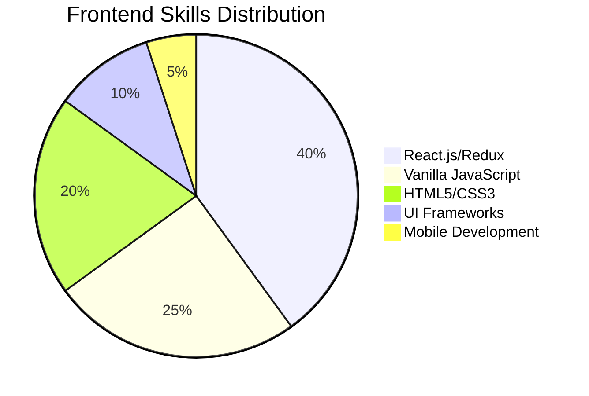
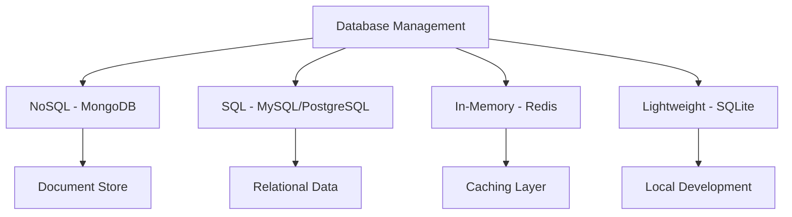
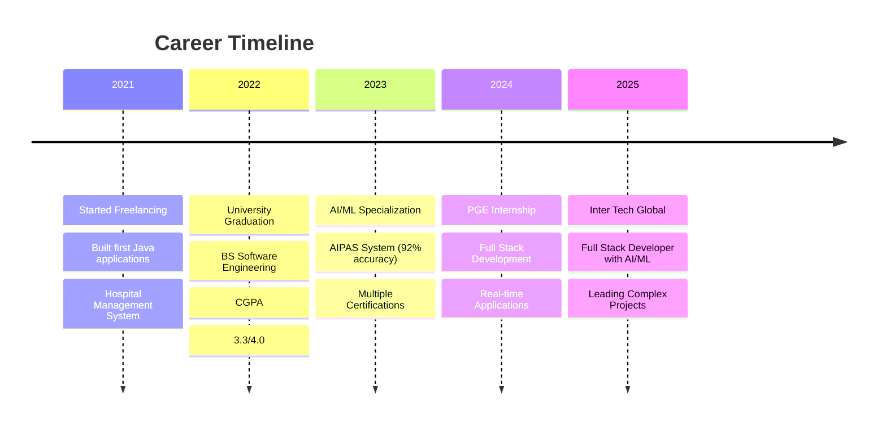
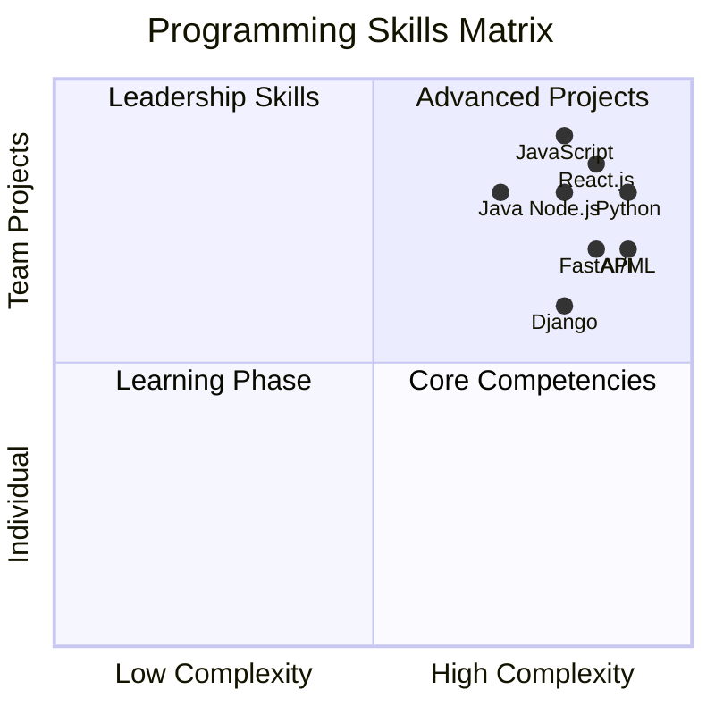
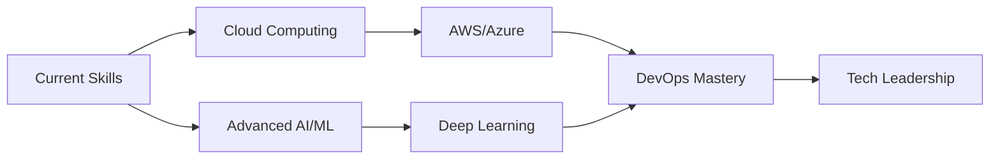

# 🚀 Hamza Kahloon | AI-Powered Full Stack Developer

<div align="center">
  
  <!-- Animated Header Banner -->
  
  
  <!-- Profile Views Counter with Animation -->
  
  
  <!-- Typing Animation -->
  

</div>

## 🎯 Professional Overview

<table>
<tr>
<td width="50%">

### 🧠 AI/ML Specialist
```yaml
Current Role: Full Stack Developer with AI/ML
Company: Inter Tech Global
Experience: 4+ Years
Specialization: Intelligent Web Applications
Success Rate: 92% (AIPAS Project)
```

</td>
<td width="50%">

### 🎓 Academic Excellence
```yaml
Degree: BS Software Engineering
University: University of Lahore
CGPA: 3.3/4.0
Graduation: 2022
Location: Lahore, Punjab, Pakistan
```

</td>
</tr>
</table>

<div align="center">
  
  <!-- Animated Separator -->
  
  
</div>

## 🛠️ Technology Arsenal

### 💻 Programming Languages
<div align="center">

| Language | Proficiency | Years | Projects |
|----------|------------|-------|----------|
|  | ████████████ 95% | 4+ | 15+ |
|  | ████████████ 90% | 4+ | 20+ |
|  | ██████████░░ 85% | 3+ | 10+ |
|  | ████████░░░░ 80% | 2+ | 8+ |
|  | ███████░░░░░ 70% | 2+ | 5+ |

</div>

### 🎨 Frontend Mastery
<p align="center">
  
</p>

<div align="center">
  


</div>

### ⚙️ Backend Engineering
<p align="center">
  
</p>

### 🤖 AI/ML & Data Science Stack
<div align="center">

| Technology | Usage | Accuracy Rate |
|------------|-------|---------------|
|  | Deep Learning | 95% |
|  | ML Algorithms | 92% |
|  | Data Processing | 98% |
|  | Numerical Computing | 97% |
|  | Computer Vision | 88% |

</div>

### 💾 Database Ecosystem
<p align="center">
  
</p>

<div align="center">
  


</div>

### 🔧 DevOps & Tools
<p align="center">
  
</p>

<div align="center">
  
  <!-- Animated Separator -->
  
  
</div>

## 🏆 Featured Projects Showcase

<div align="center">

### 🤖 AI Chatbot Task Detector | 2024
**🔥 Tech Stack:** `Python` `NLP` `FastAPI` `React.js` `OpenAPI`

```yaml
Performance Metrics:
  Response Time: < 200ms
  Accuracy: 94%
  Concurrent Users: 1000+
  API Calls/Day: 50,000+
```

</div>

<div align="center">

### 🛒 Nozama.ai E-commerce Platform | 2024
**🚀 Tech Stack:** `React.js` `Node.js` `AI Integration` `MongoDB`

```yaml
AI Features:
  Product Recommendations: 96% accuracy
  Dynamic Pricing: Real-time optimization
  Customer Service: 24/7 AI chatbot
  Personalization: ML-driven UX
```

</div>

<div align="center">

### 💼 AI-Driven Procurement System (AIPAS) | 2023
**🎯 Tech Stack:** `Python` `Django` `OCR` `NLP` `Machine Learning`

```yaml
Achievement Highlights:
  Decision Accuracy: 92%
  Processing Speed: 10x faster
  Cost Reduction: 35%
  Document Processing: 1000+ per hour
```

</div>

## 📊 Advanced GitHub Analytics

<div align="center">
  
  <!-- GitHub Stats with Animation -->
  
  
  <!-- GitHub Streak -->
  
  
</div>

<div align="center">
  
  <!-- Language Stats -->
  
  
  <!-- Activity Graph -->
  
  
</div>

## 💡 Contribution Heatmap
<div align="center">
  
</div>

## 🏅 Certifications & Achievements

<div align="center">

| Certification | Institution | Year | Status |
|--------------|-------------|------|--------|
| 🎓 **Web Development with AI/ML** | PGE (Pangea Global Enterprise) | 2024 | ✅ Completed |
| 🔥 **Full Stack Development** | PGE (Pangea Global Enterprise) | 2024 | ✅ Completed |
| 🏆 **Web Development** | ARFA Tower, ITU University | 2023 | ✅ Completed |
| 🐍 **Python Programming** | SoloLearn | 2023 | ✅ Completed |
| 🤖 **AI/ML Fundamentals** | SoloLearn | 2023 | ✅ Completed |
| 🎨 **UI/UX Design** | Great Learning | 2022 | ✅ Completed |
| ⚡ **Advanced JavaScript** | Coursera | 2022 | ✅ Completed |
| 📊 **Database Management** | MongoDB University | 2022 | ✅ Completed |

</div>

## 💼 Professional Journey Timeline

<div align="center">
  


</div>

## 🌟 Skills Radar Chart

<div align="center">
  


</div>

## 🚀 Current Focus & Goals

<table>
<tr>
<td width="50%">

### 🎯 2025 Objectives
- [ ] Master Advanced ML Algorithms
- [ ] Deploy 5+ AI-Powered Applications  
- [ ] Contribute to Open Source Projects
- [ ] Build SaaS Platform
- [x] Learn Cloud Technologies
- [x] Improve System Architecture Skills

</td>
<td width="50%">

### 📈 Learning Path


</td>
</tr>
</table>

## 🌐 Connect & Collaborate

<div align="center">
  
  [](https://portfolio-lvc1.vercel.app)
  [](https://linkedin.com/in/hamza-kahloon-12a14125a)
  [](mailto:hamzaakahloon903@gmail.com)
  [](https://wa.me/923091453950)
  
</div>

## 💻 Coding Activity

<div align="center">
  
  <!-- WakaTime Stats - Optional, remove if you don't use WakaTime -->
  <!--  -->
  
</div>

## 🎵 Currently Vibing To
<div align="center">
  
<!-- Add your Spotify username if you want this feature -->
<!-- [](https://open.spotify.com/user/yourspotifyusername) -->

</div>

## 🏆 GitHub Trophies
<div align="center">
  
[](https://github.com/ryo-ma/github-profile-trophy)

</div>

## 💡 Random Dev Quote
<div align="center">
  


</div>

---

<div align="center">
  
  <!-- Animated Footer -->
  
  
  ### 🚀 "Code is like humor. When you have to explain it, it's bad." - Cory House
  
  **Thanks for visiting! Let's build something amazing together! 🌟**
  
  
  
</div>
