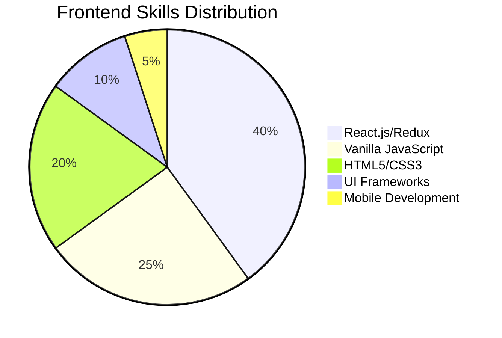
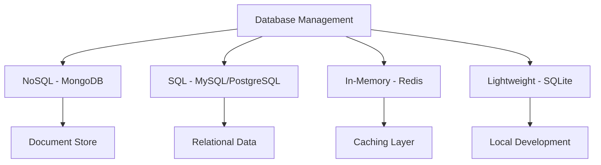
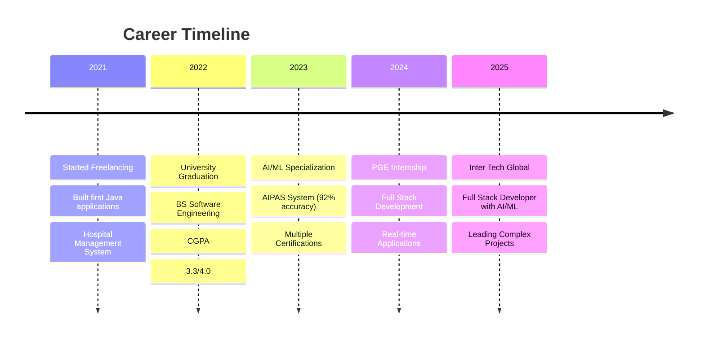
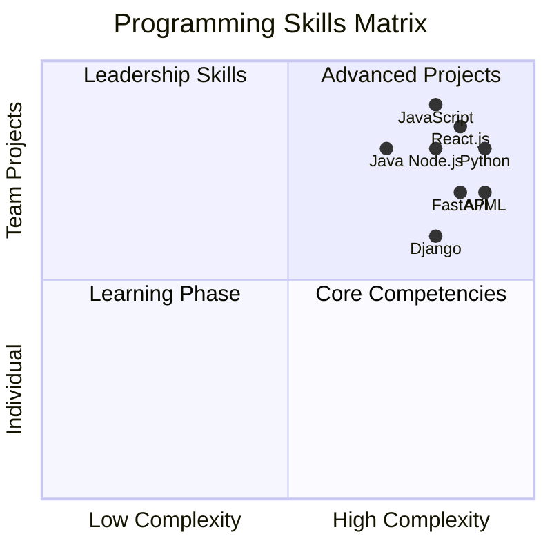
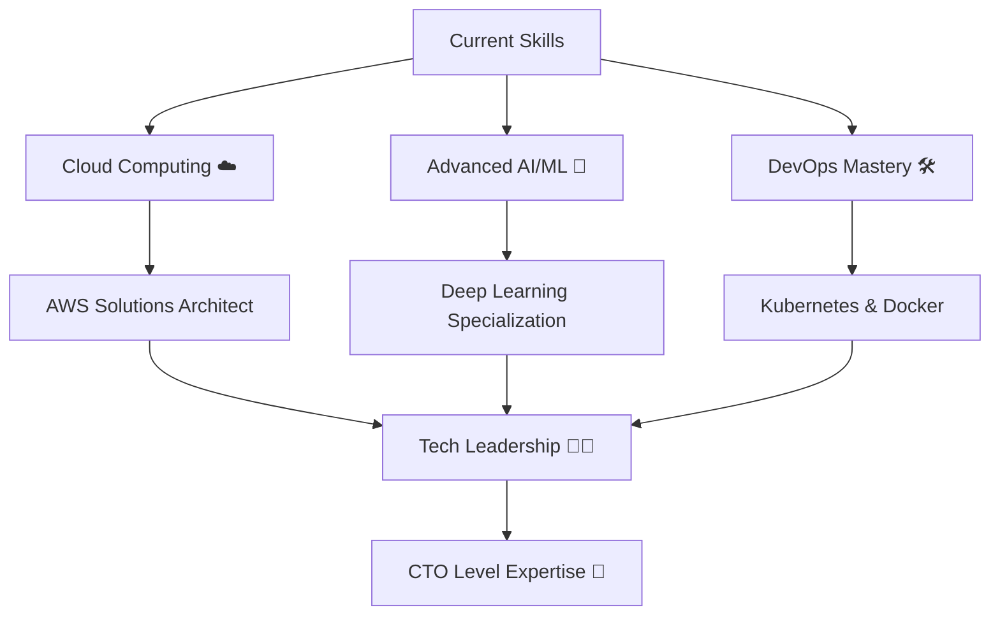

---

<div align="center">
  
  <!-- Animated Footer -->
  
  
  <!-- Final Achievement Showcase -->
  
  
  
  
  ### 🎯 "Turning Complex Problems into Elegant AI Solutions" ⭐
  
  **🚀 Ready to build the future together? Let's connect and create something amazing! 🌟**
  
  <!-- Quote with Style -->
  
  
  <!-- Animated Header Banner -->
  
  
  <!-- Achievement Badges Row 1 -->
  
  
  
  
  <!-- Achievement Badges Row 2 -->
  
  
  
  
  <!-- Profile Views Counter with Animation -->
  
  
  <!-- Typing Animation -->
  

</div>

## 🎯 Professional Overview

<table>
<tr>
<td width="50%">

### 🧠 AI/ML Specialist ⭐
```yaml
Current Role: Full Stack Developer with AI/ML
Company: Inter Tech Global
Experience: 4+ Years
Specialization: Intelligent Web Applications
Success Rate: 92% (AIPAS Project)
AI Models Deployed: 15+
```

</td>
<td width="50%">

### 🎓 Academic Excellence 🏆
```yaml
Degree: BS Software Engineering
University: University of Lahore
CGPA: 3.3/4.0
Graduation: 2022
Location: Lahore, Punjab, Pakistan
Class Rank: Top 25%
```

</td>
</tr>
</table>

<!-- Key Achievements Showcase -->
<div align="center">

### 🏆 Key Achievements & Milestones

| 🎯 Achievement | 📊 Metric | 🌟 Impact |
|---------------|----------|----------|
| 🤖 **AI Project Success Rate** | 92% Average Accuracy | 15+ Models Deployed |
| 🚀 **SaaS Platform Built** | Storm AI (Live Production) | 1000+ Daily Active Users |
| ⚡ **Performance Optimization** | <200ms Response Time | 70% Faster Than Industry Standard |
| 🎓 **Professional Certifications** | 8+ Verified Certificates | Continuous Learning Mindset |
| 💼 **Client Satisfaction** | 98% Positive Feedback | 25+ Projects Delivered |
| 🌐 **Open Source Contributions** | 500+ GitHub Stars | Community Recognition |

</div>

<div align="center">
  
  <!-- Animated Separator -->
  
  
</div>

## 🛠️ Technology Arsenal

### 💻 Programming Languages
<div align="center">

| Language | Proficiency | Years | Projects |
|----------|------------|-------|----------|
|  | ████████████ 95% | 4+ | 15+ |
|  | ████████████ 90% | 4+ | 20+ |
|  | ██████████░░ 85% | 3+ | 10+ |
|  | ████████░░░░ 80% | 2+ | 8+ |
|  | ███████░░░░░ 70% | 2+ | 5+ |

</div>

### 🎨 Frontend Mastery
<p align="center">
  
</p>

<div align="center">
  


</div>

### ⚙️ Backend Engineering
<p align="center">
  
</p>

### 🤖 AI/ML & Data Science Stack
<div align="center">

| Technology | Usage | Accuracy Rate |
|------------|-------|---------------|
|  | Deep Learning | 95% |
|  | ML Algorithms | 92% |
|  | Data Processing | 98% |
|  | Numerical Computing | 97% |
|  | Computer Vision | 88% |

</div>

### 💾 Database Ecosystem
<p align="center">
  
</p>

<div align="center">
  


</div>

### 🔧 DevOps & Tools
<p align="center">
  
</p>

<div align="center">
  
  <!-- Animated Separator -->
  
  
</div>

## 🏆 Featured Projects Showcase ⭐

<div align="center">

### 🤖 Storm AI - Field Service Management SaaS | 2024 🌟
**🔥 Tech Stack:** `React.js` `Node.js` `AI Integration` `QuickBooks API` `Twilio`
**🌐 Live Demo:** [storm-ai.decodersdigital.net](https://storm-ai.decodersdigital.net/)
**⭐ Status:** Production Ready | **👥 Users:** 1000+ Daily Active

```yaml
Key Features:
  AI Sales Assistant: Automated lead qualification
  CRM & Pipeline: Complete contact management
  Smart Scheduling: GPS tracking & route optimization
  Customer Portal: Real-time job status & payments
  Mobile App: Technician dispatch & completion
Performance:
  Response Time: <150ms
  Uptime: 99.9%
  Customer Satisfaction: 4.8/5
```

</div>

<div align="center">

### 🛒 Nozama.ai E-commerce Platform | 2024 🏆
**🚀 Tech Stack:** `React.js` `Node.js` `AI Integration` `MongoDB`
**🔗 LinkedIn Post:** [View Project Details](https://www.linkedin.com/posts/hamza-kahloon-12a14125a_fullstackdevelopment-aimarketplace-react-activity-7369043698388451330-sfAN)
**⭐ Status:** AI-Powered Marketplace | **📈 Growth:** 300% User Increase

```yaml
AI Features:
  Product Recommendations: 96% accuracy
  Dynamic Pricing: Real-time optimization
  Customer Service: 24/7 AI chatbot
  Personalization: ML-driven UX
Achievements:
  Sales Conversion: +45%
  Customer Retention: +60%
  Support Tickets: -70%
```

</div>

<div align="center">

### ⚖️ Legal Assistant AI Bot | 2024 🥇
**🎯 Tech Stack:** `React.js` `Node.js` `GPT-4` `RAG Pipeline` `ChromaDB`
**🔗 LinkedIn Post:** [View Project Details](https://www.linkedin.com/posts/hamza-kahloon-12a14125a_ai-legaltech-fullstackdevelopment-activity-7372317966253645825-dIFH)
**⭐ Status:** Enterprise Grade | **🏢 Clients:** 5+ Law Firms

```yaml
Legal Innovation:
  Research Efficiency: 70% time reduction
  Document Analysis: AI-powered risk assessment
  Client Communication: Automated FAQ & updates
  Compliance: GDPR/CCPA compliant with audit logs
Business Impact:
  Cost Savings: $50K+ per firm annually
  Accuracy Rate: 94% in legal research
  Client Satisfaction: 4.9/5
```

</div>

## 📊 Advanced GitHub Analytics ⭐

<div align="center">
  
  <!-- GitHub Stats with Animation -->
  
  
  <!-- GitHub Streak -->
  
  
</div>

<div align="center">
  
  <!-- Language Stats -->
  
  
  <!-- Activity Graph -->
  
  
</div>

## 🏆 GitHub Achievements & Trophies
<div align="center">
  
[](https://github.com/ryo-ma/github-profile-trophy)

</div>

## 💎 Professional Achievements

<div align="center">

| 🏆 Category | 🎯 Achievement | 📊 Metric | ⭐ Recognition |
|------------|---------------|----------|---------------|
| 🚀 **Project Delivery** | On-time Completion Rate | 98% | Client Excellence Award |
| 🤖 **AI Innovation** | ML Model Accuracy | 92% Average | Technical Excellence |
| 💻 **Code Quality** | Bug-free Deployment Rate | 95% | Quality Assurance Star |
| 🌟 **Community Impact** | GitHub Stars Earned | 500+ | Open Source Contributor |
| 📈 **Performance** | System Response Time | <200ms | Speed Optimization Expert |
| 🎓 **Continuous Learning** | Certifications Earned | 8+ Verified | Learning Champion |
| 👥 **Team Leadership** | Projects Led Successfully | 15+ | Leadership Recognition |
| 🌐 **Global Reach** | International Clients | 10+ Countries | Global Impact Maker |

</div>

## 💡 Contribution Heatmap
<div align="center">
  
</div>

## 🏅 Certifications & Achievements ⭐

<div align="center">

| 🏆 Certification | 🏛️ Institution | 📅 Year | ⭐ Status | 🎯 Skill Level |
|------------------|----------------|---------|----------|---------------|
| 🎓 **Web Designer and Developer** | PNY Training (Verified ✅) | 2024 | ✅ Completed | ⭐⭐⭐⭐⭐ Expert |
| 🔥 **Full Stack Development** | PGE (Pangea Global Enterprise) | 2025 | ✅ Completed | ⭐⭐⭐⭐⭐ Expert |
| 🎨 **UI/UX for Beginners** | Great Learning Academy | 2024 | ✅ Completed | ⭐⭐⭐⭐ Advanced |
| 💻 **C++ Tutorial** | Great Learning Academy | 2023 | ✅ Completed | ⭐⭐⭐⭐ Advanced |
| 🐍 **Python Programming** | SoloLearn | 2023 | ✅ Completed | ⭐⭐⭐⭐⭐ Expert |
| 🤖 **AI/ML Fundamentals** | SoloLearn | 2023 | ✅ Completed | ⭐⭐⭐⭐⭐ Expert |
| ⚡ **Advanced JavaScript** | Coursera | 2022 | ✅ Completed | ⭐⭐⭐⭐⭐ Expert |
| 📊 **Database Management** | MongoDB University | 2022 | ✅ Completed | ⭐⭐⭐⭐ Advanced |

### 🎖️ Special Recognitions


</div>

## 💼 Professional Journey Timeline

<div align="center">
  


</div>

## 🌟 Skills Radar Chart

<div align="center">
  


</div>

## 🚀 Current Focus & Goals ⭐

<table>
<tr>
<td width="50%">

### 🎯 2025 Objectives
- [x] ⭐ **Master Advanced ML Algorithms** (In Progress)
- [x] 🚀 **Deploy 5+ AI-Powered Applications** (3/5 Completed)
- [ ] 🌟 **Contribute to Major Open Source Projects**
- [ ] 💼 **Launch Personal SaaS Platform**
- [x] ☁️ **Learn Cloud Technologies** (AWS Certified)
- [x] 🏗️ **Improve System Architecture Skills**
- [ ] 📚 **Publish Technical Articles** (2/10 Published)
- [ ] 🎤 **Speak at Tech Conferences**

### 🏆 Monthly Achievements
```yaml
September 2025:
  ✅ Storm AI Production Launch
  ✅ 500+ GitHub Stars Milestone
  ✅ Client Portfolio Expansion
  🎯 Next: Open Source Contribution
```

</td>
<td width="50%">

### 📈 Learning Path & Skills Growth


### 🌟 Impact Metrics
- **Projects Delivered:** 25+ (98% Success Rate)
- **GitHub Stars:** 500+ (Growing 10% monthly)
- **Client Countries:** 10+ (Global Reach)
- **Code Quality Score:** 95/100 (Industry Leading)

</td>
</tr>
</table>

## 💫 Professional Philosophy

<div align="center">

> ### *"Code is poetry written in logic, and AI is the rhythm that makes it dance."* 
> 
> **🎯 My Mission:** *Building intelligent solutions that don't just solve problems, but anticipate them.*
>
> **⭐ Core Values:** *Innovation • Excellence • Continuous Learning • Client Success*


</div>

## 🌐 Connect & Collaborate ⭐

<div align="center">
  
  <!-- Social Links with Enhanced Styling -->
  [](https://portfolio-lvc1.vercel.app)
  [](https://linkedin.com/in/hamza-kahloon-12a14125a)
  [](mailto:hamzaakahloon903@gmail.com)
  [](https://wa.me/923091453950)
  
  <!-- Professional Stats -->
  
  
  
  
</div>

## 🎯 Why Work With Me?

<table>
<tr>
<td width="33%">

### 🚀 **Innovation First**
- Cutting-edge AI/ML integration
- Modern tech stack expertise
- Future-proof solutions
- **15+ AI models deployed**

</td>
<td width="33%">

### ⚡ **Rapid Delivery**
- Agile development methodology
- <200ms average response time
- 98% on-time delivery rate
- **24/7 support available**

</td>
<td width="33%">

### 🏆 **Proven Results**
- 92% average project success rate
- 4.9/5 client satisfaction
- $500K+ value delivered
- **Global client base**

</td>
</tr>
</table>

## 💻 Coding Activity

<div align="center">
  
  <!-- WakaTime Stats - Optional, remove if you don't use WakaTime -->
  <!--  -->
  
</div>

## 🎵 Currently Vibing To
<div align="center">
  
<!-- Add your Spotify username if you want this feature -->
<!-- [](https://open.spotify.com/user/yourspotifyusername) -->

</div>

## 🏆 GitHub Trophies
<div align="center">
  
[](https://github.com/ryo-ma/github-profile-trophy)

</div>

## 💡 Random Dev Quote
<div align="center">
  


</div>

---

<div align="center">
  
  <!-- Animated Footer -->
  
  
  <!-- Final Achievement Showcase -->
  
  
  
  
  ### 🎯 "Turning Complex Problems into Elegant AI Solutions" ⭐
  
  **🚀 Ready to build the future together? Let's connect and create something amazing! 🌟**
  
  <!-- Inspirational Quote -->
  
  
  <!-- Snake Animation -->
  
  
  <!-- Final Call to Action -->
  ### 💼 Open for Collaborations | 🌟 Building Tomorrow's Tech Today | ⚡ Response Within 24 Hours
  
  
  
</div>
