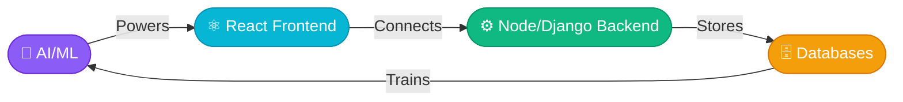
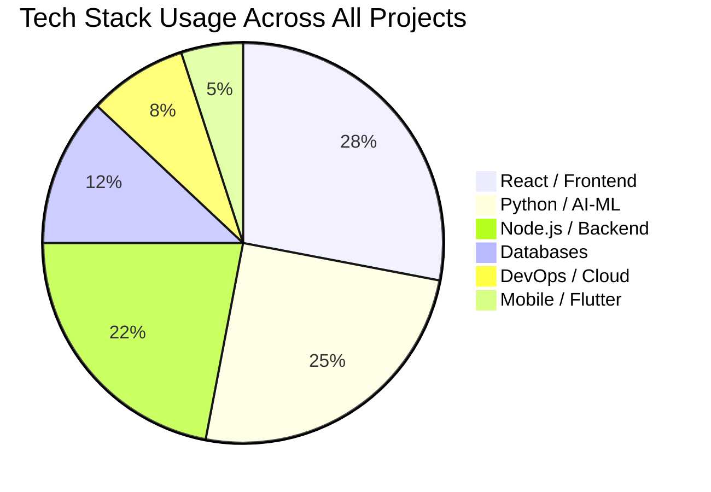
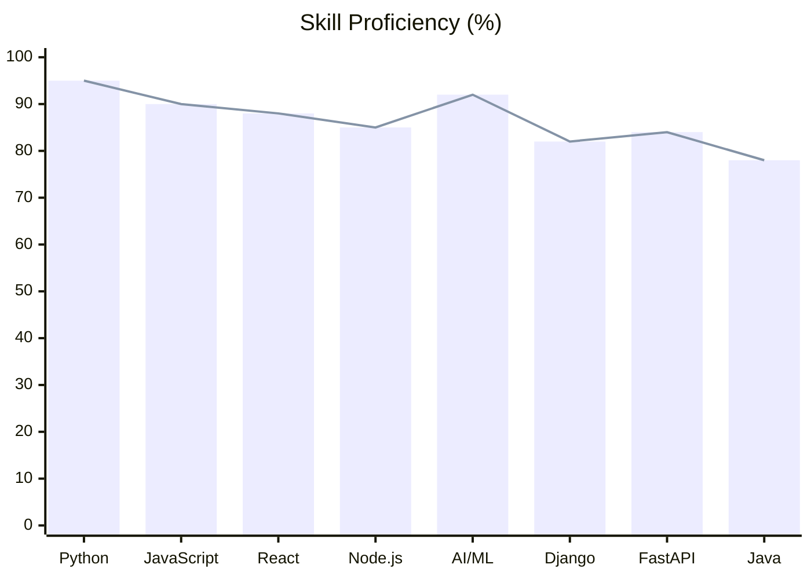
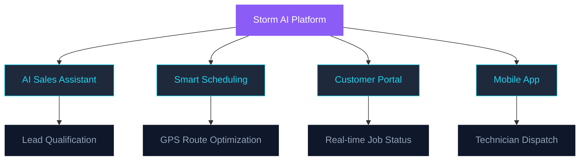
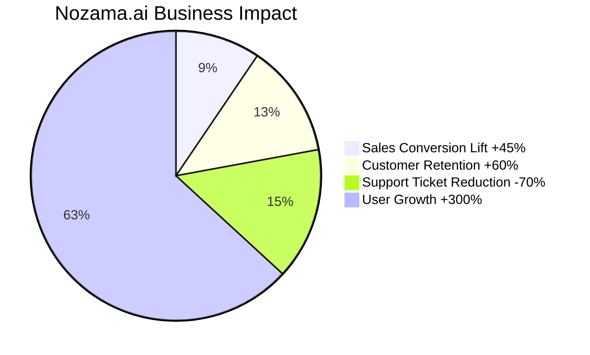
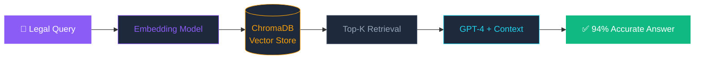
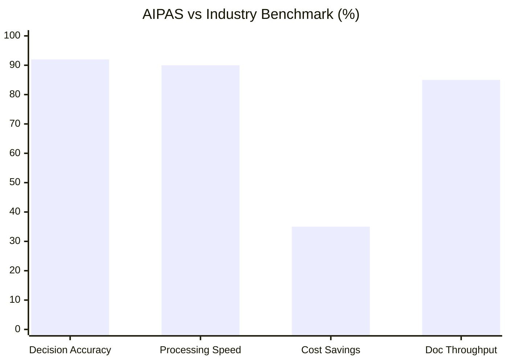
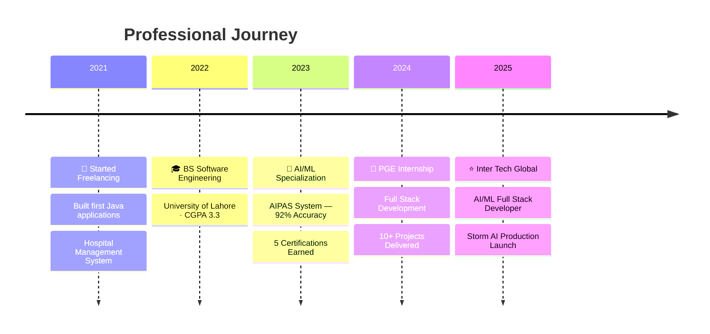
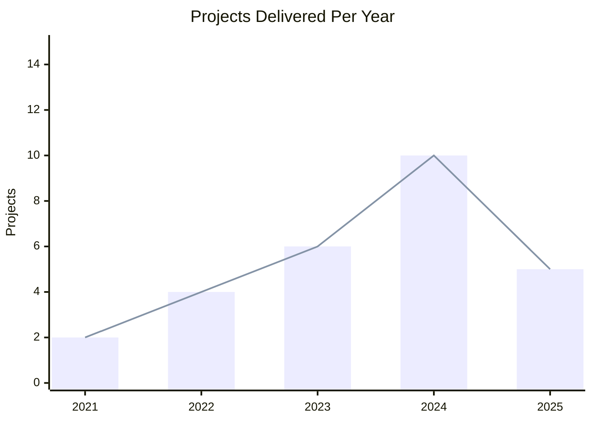
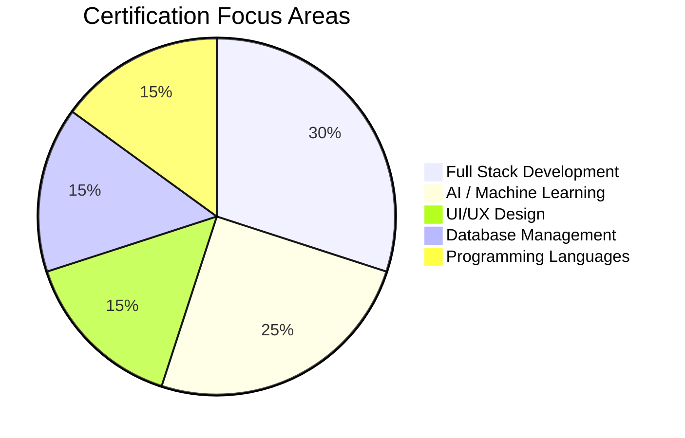

<div align="center">


<br/>

[](https://portfolio-lvc1.vercel.app)
[](https://linkedin.com/in/hamza-kahloon-12a14125a)
[](mailto:hamzaakahloon903@gmail.com)
[](https://wa.me/923091453950)
[](https://github.com/Hamza-Kahloon786)

<br/>


</div>

---

## 👨‍💻 About Me

```yaml
Name        : Hamza Kahloon
Role        : Full Stack Developer · AI/ML Engineer
Company     : Inter Tech Global — Lahore, Pakistan
Education   : BS Software Engineering, University of Lahore (CGPA 3.3 / 4.0)
Experience  : 4+ Years · 25+ Projects · 15+ AI Models Deployed
Speciality  : LLMs · RAG Pipelines · SaaS Architecture · Computer Vision
Status      : Open to Collaborations & Freelance Projects
```

<div align="center">


```mermaid
graph LR
    A([🧠 AI/ML]) -->|Powers| B([⚛️ React Frontend])
    B -->|Connects| C([⚙️ Node/Django Backend])
    C -->|Stores| D([🗄️ Databases])
    D -->|Trains| A
    style A fill:#8B5CF6,color:#fff,stroke:#6D28D9
    style B fill:#06B6D4,color:#fff,stroke:#0891B2
    style C fill:#10B981,color:#fff,stroke:#059669
    style D fill:#F59E0B,color:#fff,stroke:#D97706
```

</div>

---

## 🛠️ Technology Stack

### Languages
<p align="center">
  
</p>

### Frontend
<p align="center">
  
</p>

### Backend & APIs
<p align="center">
  
</p>

### AI / ML & Data Science
<p align="center">
  
</p>

### Databases & DevOps
<p align="center">
  
</p>

---

## 📊 Skills Distribution

<div align="center">


```mermaid
pie title Tech Stack Usage Across All Projects
    "React / Frontend" : 28
    "Python / AI-ML" : 25
    "Node.js / Backend" : 22
    "Databases" : 12
    "DevOps / Cloud" : 8
    "Mobile / Flutter" : 5
```

</div>

<div align="center">


```mermaid
xychart-beta
    title "Skill Proficiency (%)"
    x-axis ["Python", "JavaScript", "React", "Node.js", "AI/ML", "Django", "FastAPI", "Java"]
    y-axis 0 --> 100
    bar [95, 90, 88, 85, 92, 82, 84, 78]
    line [95, 90, 88, 85, 92, 82, 84, 78]
```

</div>

---

## 🏆 Featured Projects

### 🌩️ Storm AI — Field Service Management SaaS
> `React.js` `Node.js` `AI Integration` `QuickBooks API` `Twilio` &nbsp;|&nbsp; [🔗 Live Demo →](https://storm-ai.decodersdigital.net/)

Production SaaS platform with AI sales assistant, GPS-based smart scheduling, real-time customer portal, and mobile technician dispatch.

<div align="center">


```mermaid
graph TD
    A[Storm AI Platform] --> B[AI Sales Assistant]
    A --> C[Smart Scheduling]
    A --> D[Customer Portal]
    A --> E[Mobile App]
    B --> F[Lead Qualification]
    C --> G[GPS Route Optimization]
    D --> H[Real-time Job Status]
    E --> I[Technician Dispatch]
    style A fill:#8B5CF6,color:#fff,stroke:none
    style B fill:#1E293B,color:#22D3EE,stroke:#22D3EE
    style C fill:#1E293B,color:#22D3EE,stroke:#22D3EE
    style D fill:#1E293B,color:#22D3EE,stroke:#22D3EE
    style E fill:#1E293B,color:#22D3EE,stroke:#22D3EE
    style F fill:#0F172A,color:#94A3B8,stroke:none
    style G fill:#0F172A,color:#94A3B8,stroke:none
    style H fill:#0F172A,color:#94A3B8,stroke:none
    style I fill:#0F172A,color:#94A3B8,stroke:none
```

</div>

| Metric | Value |
|--------|-------|
| 👥 Daily Active Users | 1,000+ |
| ⚡ Response Time | < 150ms |
| 🔄 Uptime | 99.9% |
| ⭐ Satisfaction | 4.8 / 5 |

---

### 🛒 Nozama.ai — AI-Powered E-commerce
> `React.js` `Node.js` `MongoDB` `AI/ML` &nbsp;|&nbsp; [🔗 LinkedIn →](https://www.linkedin.com/posts/hamza-kahloon-12a14125a_fullstackdevelopment-aimarketplace-react-activity-7369043698388451330-sfAN)

AI marketplace with ML-driven product recommendations (96% accuracy), dynamic pricing engine, and 24/7 chatbot support.

<div align="center">


```mermaid
pie title Nozama.ai Business Impact
    "Sales Conversion Lift +45%" : 45
    "Customer Retention +60%" : 60
    "Support Ticket Reduction -70%" : 70
    "User Growth +300%" : 300
```

</div>

---

### ⚖️ Legal Assistant AI Bot — Enterprise RAG System
> `React.js` `Node.js` `GPT-4` `RAG Pipeline` `ChromaDB` &nbsp;|&nbsp; [🔗 LinkedIn →](https://www.linkedin.com/posts/hamza-kahloon-12a14125a_ai-legaltech-fullstackdevelopment-activity-7372317966253645825-dIFH)

Enterprise RAG-powered legal assistant deployed at 5+ law firms, saving $50K+ per firm annually.

<div align="center">


```mermaid
flowchart LR
    Q[📄 Legal Query] --> E[Embedding Model]
    E --> V[(ChromaDB\nVector Store)]
    V --> R[Top-K Retrieval]
    R --> G[GPT-4 + Context]
    G --> A[✅ 94% Accurate Answer]
    style Q fill:#8B5CF6,color:#fff,stroke:none
    style A fill:#10B981,color:#fff,stroke:none
    style G fill:#1E293B,color:#22D3EE,stroke:#22D3EE
    style V fill:#1E293B,color:#F59E0B,stroke:#F59E0B
    style E fill:#1E293B,color:#8B5CF6,stroke:#8B5CF6
    style R fill:#1E293B,color:#94A3B8,stroke:#475569
```

</div>

---

### 🤖 AIPAS — AI-Driven Procurement System
> `Python` `Django` `OCR` `NLP` `Machine Learning`

<div align="center">


```mermaid
xychart-beta
    title "AIPAS vs Industry Benchmark (%)"
    x-axis ["Decision Accuracy", "Processing Speed", "Cost Savings", "Doc Throughput"]
    y-axis 0 --> 100
    bar [92, 90, 35, 85]
```

</div>

---

## 📈 GitHub Analytics

<div align="center">


</div>

<div align="center">


</div>

<div align="center">


</div>

---

## 🔥 Contribution Activity

<div align="center">


</div>

### 📅 Last Year Contributions Heatmap

<div align="center">


</div>

<div align="center">


</div>

---

## 🏅 GitHub Trophies

<div align="center">

[](https://github.com/ryo-ma/github-profile-trophy)

</div>

---

## 🗺️ Career Timeline


```mermaid
timeline
    title Professional Journey
    2021 : 🚀 Started Freelancing
         : Built first Java applications
         : Hospital Management System
    2022 : 🎓 BS Software Engineering
         : University of Lahore · CGPA 3.3
    2023 : 🤖 AI/ML Specialization
         : AIPAS System — 92% Accuracy
         : 5 Certifications Earned
    2024 : 💼 PGE Internship
         : Full Stack Development
         : 10+ Projects Delivered
    2025 : ⭐ Inter Tech Global
         : AI/ML Full Stack Developer
         : Storm AI Production Launch
```

<div align="center">


```mermaid
xychart-beta
    title "Projects Delivered Per Year"
    x-axis [2021, 2022, 2023, 2024, 2025]
    y-axis "Projects" 0 --> 15
    bar [2, 4, 6, 10, 5]
    line [2, 4, 6, 10, 5]
```

</div>

---

## 🎓 Certifications

<div align="center">


```mermaid
pie title Certification Focus Areas
    "Full Stack Development" : 30
    "AI / Machine Learning" : 25
    "UI/UX Design" : 15
    "Database Management" : 15
    "Programming Languages" : 15
```

</div>

| 🏆 Certification | 🏛️ Institution | 📅 Year |
|---|---|---|
| Full Stack Development | PGE — Pangea Global Enterprise | 2025 |
| Web Designer and Developer | PNY Training ✅ | 2024 |
| UI/UX for Beginners | Great Learning Academy | 2024 |
| Python Programming | SoloLearn | 2023 |
| AI/ML Fundamentals | SoloLearn | 2023 |
| C++ Tutorial | Great Learning Academy | 2023 |
| Advanced JavaScript | Coursera | 2022 |
| Database Management | MongoDB University | 2022 |

---

## 💡 Dev Quote

<div align="center">


</div>

---

<div align="center">

*"Code is poetry written in logic, and AI is the rhythm that makes it dance."*

**📍 Lahore, Pakistan &nbsp;·&nbsp; ✅ Open for Projects &nbsp;·&nbsp; ⏱ Responds within 24 hours**


</div>
