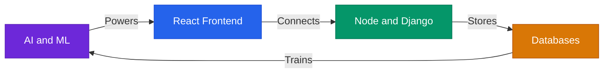
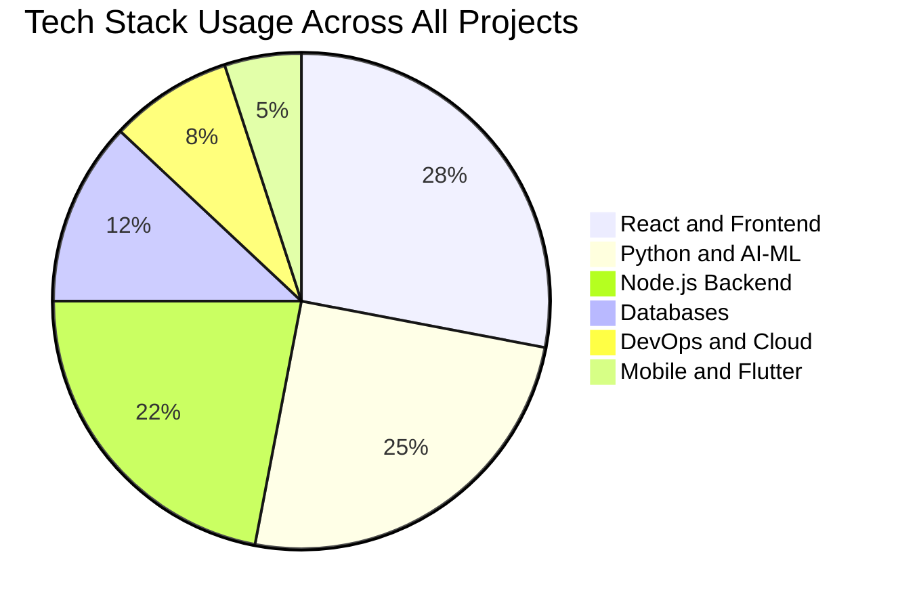
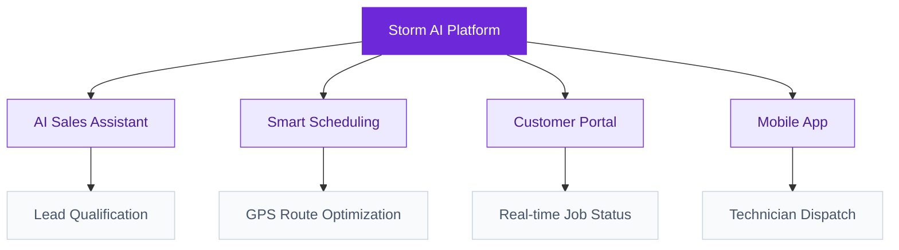
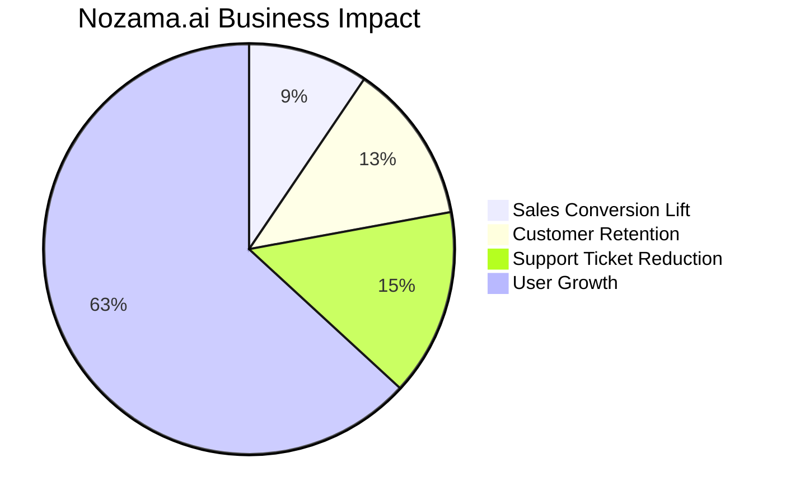
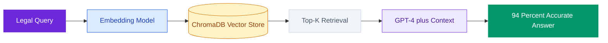
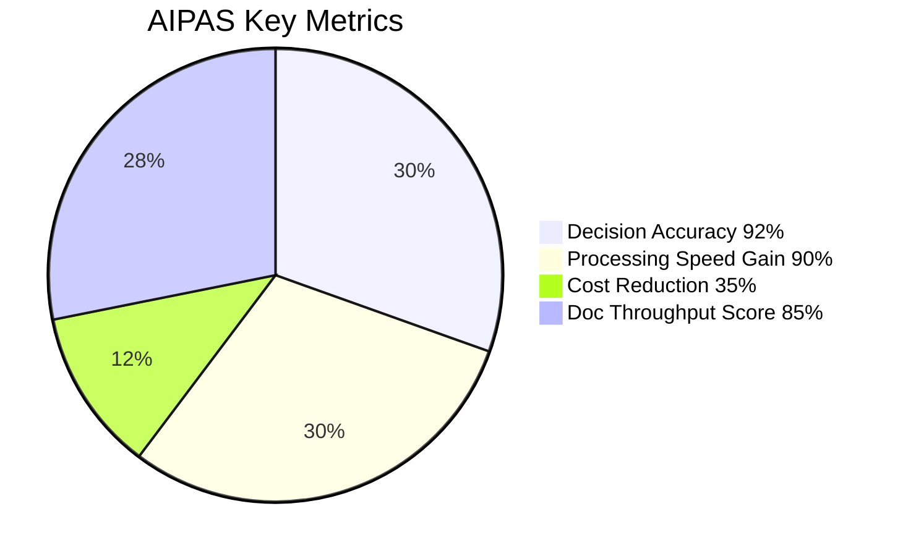
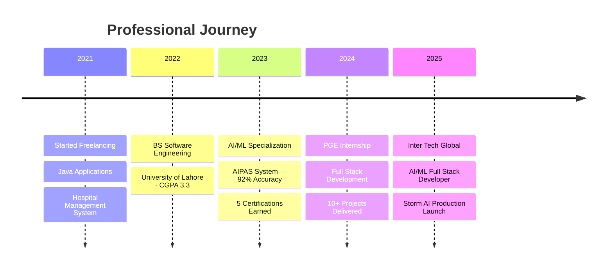
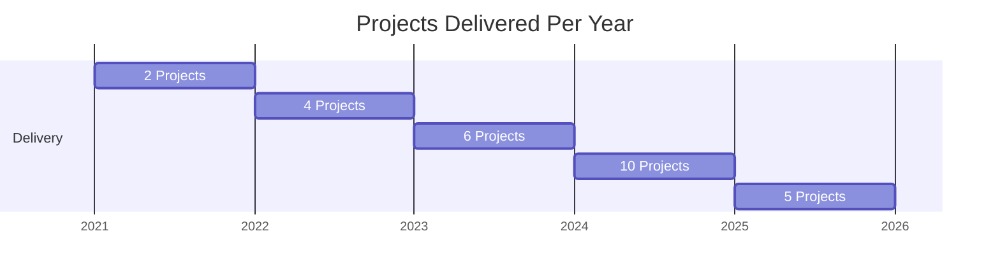
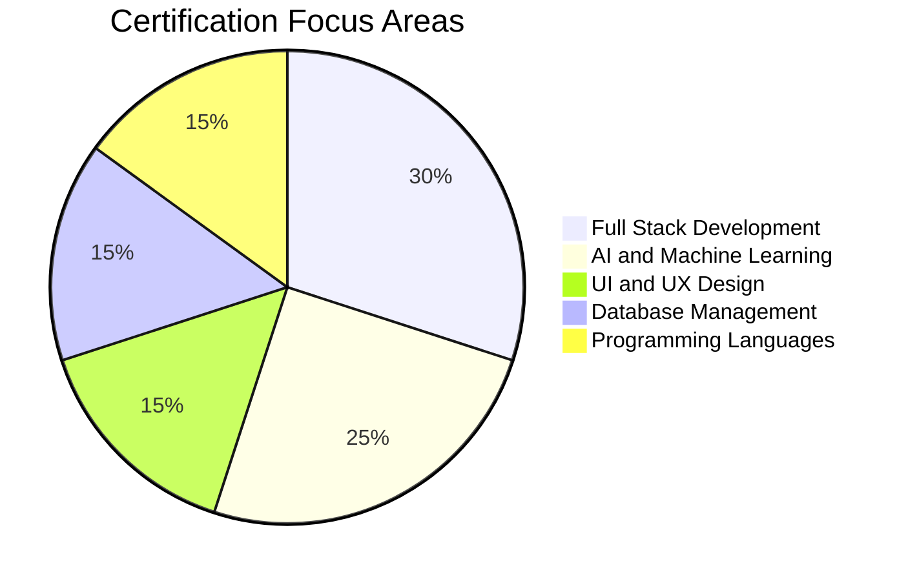

<div align="center">


<br/>

[](https://portfolio-lvc1.vercel.app)
[](https://linkedin.com/in/hamza-kahloon-12a14125a)
[](mailto:hamzaakahloon903@gmail.com)
[](https://wa.me/923091453950)
[](https://github.com/Hamza-Kahloon786)

<br/>


</div>

---

## 👨‍💻 About Me

```yaml
Name        : Hamza Kahloon
Role        : Full Stack Developer · AI/ML Engineer
Company     : Inter Tech Global — Lahore, Pakistan
Education   : BS Software Engineering, University of Lahore (CGPA 3.3 / 4.0)
Experience  : 4+ Years · 25+ Projects · 15+ AI Models Deployed
Speciality  : LLMs · RAG Pipelines · SaaS Architecture · Computer Vision
Status      : Open to Collaborations & Freelance Projects
```

<div align="center">


```mermaid
graph LR
    A[AI and ML] -->|Powers| B[React Frontend]
    B -->|Connects| C[Node and Django]
    C -->|Stores| D[Databases]
    D -->|Trains| A
    style A fill:#6D28D9,color:#fff,stroke:#5B21B6
    style B fill:#2563EB,color:#fff,stroke:#1D4ED8
    style C fill:#059669,color:#fff,stroke:#047857
    style D fill:#D97706,color:#fff,stroke:#B45309
```

</div>

---

## 🛠️ Technology Stack

### Languages
<p align="center">
  
</p>

### Frontend
<p align="center">
  
</p>

### Backend & APIs
<p align="center">
  
</p>

### AI / ML & Data Science
<p align="center">
  
</p>

### Databases & DevOps
<p align="center">
  
</p>

---

## 📊 Skills at a Glance

<div align="center">


```mermaid
pie title Tech Stack Usage Across All Projects
    "React and Frontend" : 28
    "Python and AI-ML" : 25
    "Node.js Backend" : 22
    "Databases" : 12
    "DevOps and Cloud" : 8
    "Mobile and Flutter" : 5
```

</div>

<div align="center">


```mermaid
gantt
    title Skill Proficiency Overview
    dateFormat X
    axisFormat %s%%
    section Languages
    Python 95%       : 0, 95
    JavaScript 90%   : 0, 90
    Java 78%         : 0, 78
    section Frontend
    React 88%        : 0, 88
    Tailwind 85%     : 0, 85
    section Backend
    Node.js 85%      : 0, 85
    Django 82%       : 0, 82
    FastAPI 84%      : 0, 84
    section AI and ML
    AI and ML 92%    : 0, 92
    TensorFlow 88%   : 0, 88
    OpenCV 80%       : 0, 80
```

</div>

---

## 🏆 Featured Projects

### Storm AI — Field Service Management SaaS
> `React.js` `Node.js` `AI Integration` `QuickBooks API` `Twilio` &nbsp;|&nbsp; [🔗 Live Demo →](https://storm-ai.decodersdigital.net/)

Production SaaS platform with AI sales assistant, GPS-based smart scheduling, real-time customer portal, and mobile technician dispatch — serving **1,000+ daily active users** at 99.9% uptime.

<div align="center">


```mermaid
graph TD
    A[Storm AI Platform] --> B[AI Sales Assistant]
    A --> C[Smart Scheduling]
    A --> D[Customer Portal]
    A --> E[Mobile App]
    B --> F[Lead Qualification]
    C --> G[GPS Route Optimization]
    D --> H[Real-time Job Status]
    E --> I[Technician Dispatch]
    style A fill:#6D28D9,color:#fff,stroke:none
    style B fill:#EDE9FE,color:#4C1D95,stroke:#7C3AED
    style C fill:#EDE9FE,color:#4C1D95,stroke:#7C3AED
    style D fill:#EDE9FE,color:#4C1D95,stroke:#7C3AED
    style E fill:#EDE9FE,color:#4C1D95,stroke:#7C3AED
    style F fill:#F8FAFC,color:#475569,stroke:#CBD5E1
    style G fill:#F8FAFC,color:#475569,stroke:#CBD5E1
    style H fill:#F8FAFC,color:#475569,stroke:#CBD5E1
    style I fill:#F8FAFC,color:#475569,stroke:#CBD5E1
```

</div>

| Metric | Value |
|--------|-------|
| 👥 Daily Active Users | 1,000+ |
| ⚡ Response Time | < 150ms |
| 🔄 Uptime | 99.9% |
| ⭐ Satisfaction | 4.8 / 5 |

---

### Nozama.ai — AI-Powered E-commerce
> `React.js` `Node.js` `MongoDB` `AI/ML` &nbsp;|&nbsp; [🔗 LinkedIn →](https://www.linkedin.com/posts/hamza-kahloon-12a14125a_fullstackdevelopment-aimarketplace-react-activity-7369043698388451330-sfAN)

AI marketplace with ML-driven product recommendations (96% accuracy), dynamic pricing engine, and 24/7 chatbot support.

<div align="center">


```mermaid
pie title Nozama.ai Business Impact
    "Sales Conversion Lift" : 45
    "Customer Retention" : 60
    "Support Ticket Reduction" : 70
    "User Growth" : 300
```

</div>

---

### Legal Assistant AI Bot — Enterprise RAG System
> `React.js` `Node.js` `GPT-4` `RAG Pipeline` `ChromaDB` &nbsp;|&nbsp; [🔗 LinkedIn →](https://www.linkedin.com/posts/hamza-kahloon-12a14125a_ai-legaltech-fullstackdevelopment-activity-7372317966253645825-dIFH)

Enterprise RAG-powered legal assistant deployed at 5+ law firms — 94% accuracy, 70% faster research, saving $50K+ per firm annually.

<div align="center">


```mermaid
flowchart LR
    Q[Legal Query] --> E[Embedding Model]
    E --> V[(ChromaDB Vector Store)]
    V --> R[Top-K Retrieval]
    R --> G[GPT-4 plus Context]
    G --> A[94 Percent Accurate Answer]
    style Q fill:#6D28D9,color:#fff,stroke:none
    style A fill:#059669,color:#fff,stroke:none
    style G fill:#EDE9FE,color:#4C1D95,stroke:#7C3AED
    style V fill:#FEF3C7,color:#92400E,stroke:#D97706
    style E fill:#DBEAFE,color:#1E40AF,stroke:#2563EB
    style R fill:#F1F5F9,color:#475569,stroke:#CBD5E1
```

</div>

---

### AIPAS — AI-Driven Procurement System
> `Python` `Django` `OCR` `NLP` `Machine Learning` &nbsp;|&nbsp; [🔗 Live →](http://aipas.duckdns.org)

Intelligent procurement automation achieving **92% decision accuracy**, processing 1,000+ documents per hour — 10× faster than manual workflows with 35% cost reduction.

<div align="center">


```mermaid
pie title AIPAS Key Metrics
    "Decision Accuracy 92%" : 92
    "Processing Speed Gain 90%" : 90
    "Cost Reduction 35%" : 35
    "Doc Throughput Score 85%" : 85
```

</div>

---

### AI Dentist Reception System
> `Python` `Flask` `AI/ML` `SQLite`

Smart clinic automation handling appointment scheduling, patient triage, and ML-based treatment suggestions — saving 60% of administrative time.

---

## 📈 GitHub Analytics

<div align="center">


</div>

<div align="center">


</div>

<div align="center">


</div>

---

## 🔥 Contribution Activity

<div align="center">


</div>

### 📅 Last Year Contributions

<div align="center">


</div>

<div align="center">


</div>

---

## 🏅 GitHub Trophies

<div align="center">

[](https://github.com/ryo-ma/github-profile-trophy)

</div>

---

## 🗺️ Career Timeline


```mermaid
timeline
    title Professional Journey
    2021 : Started Freelancing
         : Java Applications
         : Hospital Management System
    2022 : BS Software Engineering
         : University of Lahore · CGPA 3.3
    2023 : AI/ML Specialization
         : AIPAS System — 92% Accuracy
         : 5 Certifications Earned
    2024 : PGE Internship
         : Full Stack Development
         : 10+ Projects Delivered
    2025 : Inter Tech Global
         : AI/ML Full Stack Developer
         : Storm AI Production Launch
```

<div align="center">


```mermaid
gantt
    title Projects Delivered Per Year
    dateFormat YYYY
    axisFormat %Y
    section Delivery
    2 Projects   : 2021, 2022
    4 Projects   : 2022, 2023
    6 Projects   : 2023, 2024
    10 Projects  : 2024, 2025
    5 Projects   : 2025, 2026
```

</div>

---

## 🎓 Certifications

<div align="center">


```mermaid
pie title Certification Focus Areas
    "Full Stack Development" : 30
    "AI and Machine Learning" : 25
    "UI and UX Design" : 15
    "Database Management" : 15
    "Programming Languages" : 15
```

</div>

| 🏆 Certification | 🏛️ Institution | 📅 Year |
|---|---|---|
| Full Stack Development | PGE — Pangea Global Enterprise | 2025 |
| Web Designer and Developer | PNY Training ✅ | 2024 |
| UI/UX for Beginners | Great Learning Academy | 2024 |
| Python Programming | SoloLearn | 2023 |
| AI/ML Fundamentals | SoloLearn | 2023 |
| C++ Tutorial | Great Learning Academy | 2023 |
| Advanced JavaScript | Coursera | 2022 |
| Database Management | MongoDB University | 2022 |

---

## 💡 Dev Quote

<div align="center">


</div>

---

<div align="center">

*"Code is poetry written in logic, and AI is the rhythm that makes it dance."*

**📍 Lahore, Pakistan &nbsp;·&nbsp; ✅ Open for Projects &nbsp;·&nbsp; ⏱ Responds within 24 hours**


</div>
