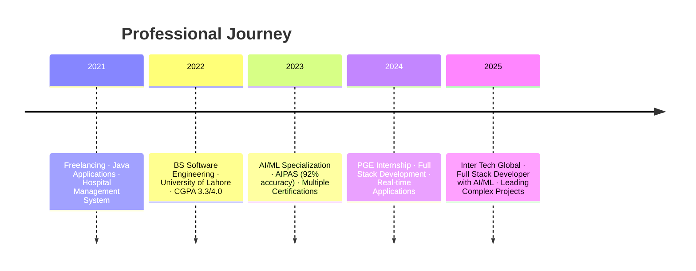

<div align="center">


<br/>

[](https://portfolio-lvc1.vercel.app)
[](https://linkedin.com/in/hamza-kahloon-12a14125a)
[](mailto:hamzaakahloon903@gmail.com)
[](https://wa.me/923091453950)
[](https://github.com/Hamza-Kahloon786)

</div>

---

## About Me

Full Stack Developer with **4+ years of experience** building AI-powered web applications. Currently at **Inter Tech Global**, where I lead development of intelligent solutions across SaaS platforms, enterprise systems, and client-facing products. I specialize in bridging the gap between clean frontend UIs and powerful ML backends.

```yaml
Role       : Full Stack Developer with AI/ML Focus
Company    : Inter Tech Global — Lahore, Pakistan
Education  : BS Software Engineering, University of Lahore (CGPA 3.3/4.0)
Interests  : LLMs, RAG Pipelines, SaaS Architecture, Computer Vision
Status     : Open to collaborations and freelance projects
```

---

## Tech Stack

### Languages & Core
<p>
  
  
  
  
  
</p>

### Frontend
<p>
  
  
  
  
  
</p>

### Backend & APIs
<p>
  
  
  
  
  
</p>

### AI / ML
<p>
  
  
  
  
  
</p>

### Databases & DevOps
<p>
  
  
  
  
  
  
</p>

---

## Featured Projects

### 🌩️ Storm AI — Field Service Management SaaS
> **React.js · Node.js · AI Integration · QuickBooks API · Twilio** &nbsp;|&nbsp; [Live →](https://storm-ai.decodersdigital.net/)

A production SaaS platform for field service teams. Features an AI sales assistant for automated lead qualification, smart scheduling with GPS/route optimization, a customer portal with real-time job tracking, and mobile technician dispatch — serving **1,000+ daily active users** at 99.9% uptime.

---

### 🛒 Nozama.ai — AI-Powered E-commerce Marketplace
> **React.js · Node.js · MongoDB · AI/ML** &nbsp;|&nbsp; [LinkedIn →](https://www.linkedin.com/posts/hamza-kahloon-12a14125a_fullstackdevelopment-aimarketplace-react-activity-7369043698388451330-sfAN)

Marketplace platform with ML-driven product recommendations (96% accuracy), dynamic pricing, and a 24/7 AI support chatbot. Resulted in a **45% lift in sales conversion** and **70% reduction in support tickets**.

---

### ⚖️ Legal Assistant AI Bot
> **React.js · Node.js · GPT-4 · RAG Pipeline · ChromaDB** &nbsp;|&nbsp; [LinkedIn →](https://www.linkedin.com/posts/hamza-kahloon-12a14125a_ai-legaltech-fullstackdevelopment-activity-7372317966253645825-dIFH)

Enterprise-grade RAG-powered legal assistant deployed at 5+ law firms. Delivers **94% accuracy** on legal research tasks, cutting research time by 70% and saving clients $50K+ annually. Fully GDPR/CCPA compliant with audit logging.

---

### 🤖 AIPAS — AI-Driven Procurement System
> **Python · Django · OCR · NLP · Machine Learning**

Intelligent procurement automation system achieving **92% decision accuracy**, processing 1,000+ documents per hour at 10× the speed of manual workflows and reducing procurement costs by 35%.

---

### 🦷 AI Dentist Reception System
> **Python · Flask · AI/ML · SQLite**

Smart clinic automation tool handling appointment scheduling, patient triage, and ML-based treatment suggestions — saving 60% of administrative time per clinic.

---

## GitHub Stats

<div align="center">


</div>

---

## Career Timeline


```mermaid
timeline
    title Professional Journey
    2021 : Freelancing · Java Applications · Hospital Management System
    2022 : BS Software Engineering · University of Lahore · CGPA 3.3/4.0
    2023 : AI/ML Specialization · AIPAS (92% accuracy) · Multiple Certifications
    2024 : PGE Internship · Full Stack Development · Real-time Applications
    2025 : Inter Tech Global · Full Stack Developer with AI/ML · Leading Complex Projects
```

---

## Certifications

| Certification | Institution | Year |
|---|---|---|
| Full Stack Development | PGE — Pangea Global Enterprise | 2025 |
| Web Designer and Developer | PNY Training ✅ | 2024 |
| UI/UX for Beginners | Great Learning Academy | 2024 |
| Python Programming | SoloLearn | 2023 |
| AI/ML Fundamentals | SoloLearn | 2023 |
| C++ Tutorial | Great Learning Academy | 2023 |
| Advanced JavaScript | Coursera | 2022 |
| Database Management | MongoDB University | 2022 |

---

<div align="center">

*"Code is poetry written in logic, and AI is the rhythm that makes it dance."*

**📍 Lahore, Pakistan &nbsp;·&nbsp; 💼 Open for Projects &nbsp;·&nbsp; ⏱ Responds within 24 hours**


</div>
